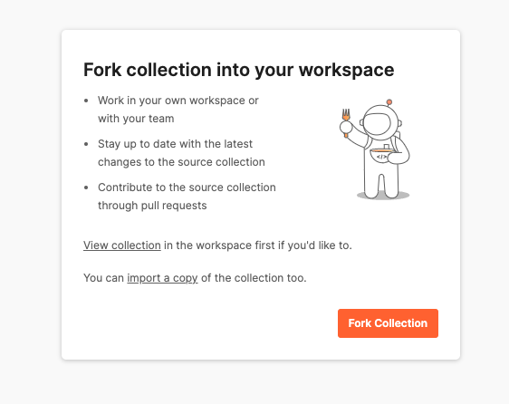

## Postman Collection

You can download the [Postman app or use the web version](https://www.postman.com/downloads/).

Go to the [Musiio by SoundCloud Public API workspace](https://www.postman.com/soundcloud-musiio/workspace/musiio-by-soundcloud-public-api-workspace/overview)

The workspace contains the:

[Tag API V1 Postman Collection](https://www.postman.com/soundcloud-musiio/workspace/musiio-by-soundcloud-public-api-workspace/collection/29141210-8cee2d19-5b14-4497-a931-3e72a50c85eb?action=share&creator=29141210)

## How to use the Postman Collection

1. Open the Postman app or web version
2. In a browser go to [Tag API V1 Postman Collection](https://www.postman.com/soundcloud-musiio/workspace/musiio-by-soundcloud-public-api-workspace/collection/29141210-8cee2d19-5b14-4497-a931-3e72a50c85eb?action=share&creator=29141210)
3. In the overview tab, scroll down and click the 'Run in Postman' button



4. This will Fork the collection into your workspace, you can also choose to import a copy as well
6. You will see the collection folder appears on the left-side panel. Click to expand to see an individual request query.
7. Now you need to add your API key in to authorize your request. Click on the "three dots" icon on the right of the collection folder tab when your mouse hovers on it. Click "Edit". Under the "Authorization" tab, select "Basic Auth" and copy paste your **Tagging API key** into the "username" field. Leave the "password" field empty. Click "Update" to update your collection.

Now you are all set and it is time to use the sample.

## Upload Audio File

1. Click on "Upload Audio File" query under your collection. On the main panel, click on "Body" and select "form-data"
2. Input KEY as "audio" and press "Select Files" under VALUE to select an audio file to be uploaded
3. Press "**Send**" to send the request.

You will receive response at the bottom panel

## Upload YouTube Link

1. Click on "Upload YouTube Link" query under your collection. On the main panel, click on "Body" and select "raw", on the right select "JSON" in the dropdown menu.
2. Input the following into the textbox:

   ```json
   {
   	"link": "YOUR YOUTUBE LINK HERE"
   }
   ```

3. Press "**Send**" to send the request.

You will receive response at the bottom panel

## Upload Audio Link

1. Click on "Upload Audio Link" query under your collection. On the main panel, click on "Body" and select "raw", on the right select "JSON" in the dropdown menu.
2. Input the following into the textbox:

   ```json
   {
   	"link": "YOUR AUDIO LINK HERE"
   }
   ```
3. Press "**Send**" to send the request.
4. You will receive response at the bottom panel

## Extract Tags

1. Click on "Extract Tags" query under your collection. On the main panel, click on "Body" and select "raw", on the right select "JSON" in the dropdown menu.
2. Input the following into the textbox:

   ```json
   {
       "id": "TRACK ID HERE",
       "tags": ["CONTENT TYPE", "GENRE V3", "MOOD", "BPM", "KEY", "KEY SHARP", "ENERGY", "INSTRUMENTATION"]
   }
   ```
   You can add or remove tags from the array in the sample above to customize the tags you want to receive
3. Press "**Send**" to send the request.
4. You will receive response at the bottom panel
